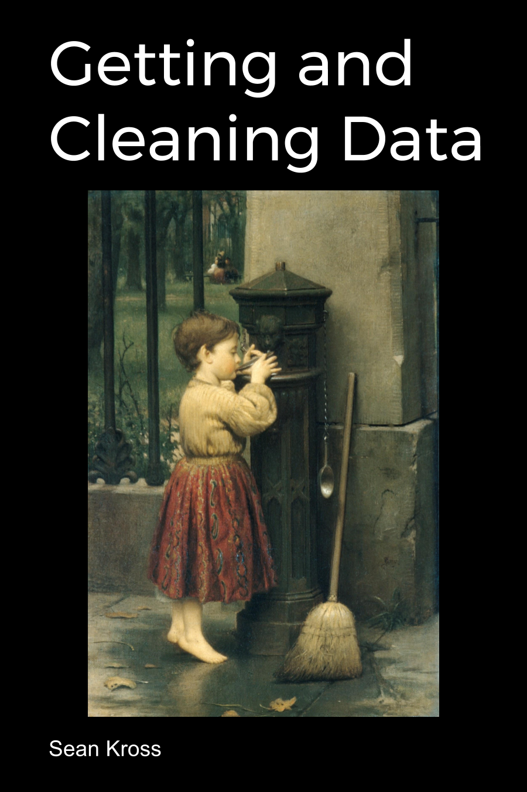

# Title Page {-}

Cover Image: *The Crossing Sweeper* by Seymour Joseph Guy

This work by [Sean Kross](http://seankross.com) is licensed
[CC BY 4.0](https://creativecommons.org/licenses/by/4.0/).

# Introduction {-}

We are currently in a strange time with respect to people's beliefs and
attitudes about data. You may have heard phrases like
["data is the new oil"](https://www.economist.com/news/leaders/21721656-data-economy-demands-new-approach-antitrust-rules-worlds-most-valuable-resource)
or ["the world is awash with data"](http://informatics.mit.edu/blog/making-decisions-world-awash-data-we%E2%80%99re-going-need-different-boat-comments-anthony). Despite the apparent value and ubiquity of
data it is not obvious how data are generated, how generated data are collected,
or how collected raw data are organized into a structure that is useful and meaningful.
Nearly all of the "interesting" data being discussed in the public
discourse is data that you likely don't have access to: a small business' Amazon
purchases, a celebrity's Facebook social graph, or the collective Google
searches of a far-away country. Even if you have access to interesting data,
it is often not obvious how to import raw data into an environment where you can
examine it, or how to manipulate the data into a form so that it can be analyzed.

The goal of this book is teach you principles that can be applied to thinking
about data at any scale, and to equip you with technical skills so that the
structure or state of your data is not an obstacle in the way of accomplishing
your ultimate goals. A core part of data science is doing what has been characterized as
["data janitor"](https://www.nytimes.com/2014/08/18/technology/for-big-data-scientists-hurdle-to-insights-is-janitor-work.html)
type work. 
This work is often perceived as unglamorous compared to other parts of the data
analytic process like visualization or modeling, however in this book I hope to
show how data wrangling can be fun! The integrity of any data analysis depends on
data that has been obtained and reshaped responsibly, which makes it difficult
to over-emphasize the importance of methods for getting and cleaning data.
The ability to develop readable, approachable, and flexible code for handling 
data will only increase in demand considering the growing role that data plays 
in our society.

It's not at all obvious how to obtain datasets that are appropriate for data
scientific methods. Unlike oil, data
doesn't require millions of dollars in infrastructure to start collecting
fractional amounts of the raw material. If you wanted to, you could start
logging the outdoor temperature in the mornings, or how many birds you see every
day. The issue with this kind of data collection is that it doesn't scale well:
it requires you as an individual to make a single observation every day.
Most data generated today are not made by people recording observations, they are
made by computers logging the actions or behaviors of people or even other
computers. In this book you will learn where to find datasets and how to
write programs for collecting data.

This book focuses on tools in the [R programming language](https://www.r-project.org/),
so you should already be familiar with the basics of R before you begin this
book. If you're new to R I highly suggest getting started with
[R Programming for Data Science](https://leanpub.com/rprogramming) by
[Roger Peng](https://twitter.com/rdpeng) or with [Swirl](http://swirlstats.com/)
for a more interactive approach. If you're interested in a thorough treatment
of advanced topics in R programming I recommend
[Mastering Software Development in R](https://leanpub.com/msdr) by Roger Peng,
[Brooke Anderson](https://twitter.com/gbwanderson), and
[me](https://twitter.com/seankross).
